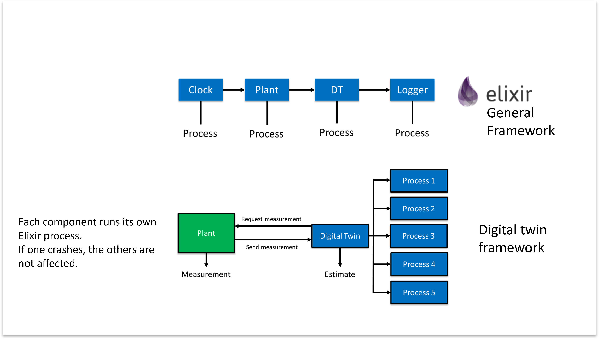
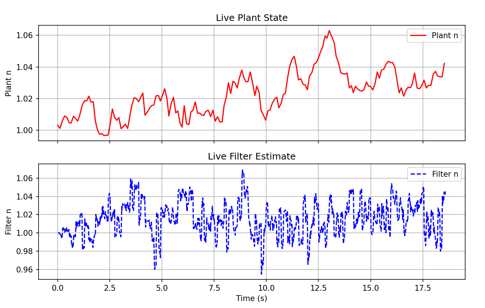

# Fault-Tolerant Digital Twin in Elixir

This project implements a fault-tolerant particle filter digital twin using Elixir.  
It simulates a nuclear power plant (e.g., reactor + heat exchanger) and demonstrates real-time resilience by running multiple Elixir processes for state estimation.  
If one process fails, the rest continue running, maintaining a degraded but functional digital twin.

---

## Key Features
- Particle filter-based state estimation with uncertainty  
- Fault-tolerant supervision tree: if one process crashes, the twin continues running  
- Real-time visualization using a Python plotting script  
- Modular design for experimenting with fault injection and resilience  

---

## Why This Matters
Safety-critical systems in industrial control and autonomous environments must withstand failures without losing core functionality.  
This project explores how Elixir’s fault-tolerant design can provide resilience for digital twins in ICS/OT applications.

---

## How It Works

Each component runs as its own **Elixir process**. If one crashes, the others remain unaffected, demonstrating fault isolation and resilience.



- **Clock** triggers periodic updates  
- **Plant** simulates the system dynamics  
- **Digital Twin** estimates system state using a particle filter  
- **Logger** records results for visualization  

The digital twin uses 5 parallel processes, each running 200 particles.  
Killing one process reduces the total particles but the system continues running in degraded mode.

---

### Example Output

When running the Python visualization script, you’ll see the evolving particle distribution over time:



As processes are killed, the uncertainty in the plot grows, but the system continues functioning until the final process is removed.

---

## Getting Started

### 1. Requirements
- **Elixir** (>= 1.14)  
- **Python 3** with `matplotlib` installed  

### 2. Clone this Repository
```bash
git clone https://github.com/MKapuria/elixir-fault-tolerant-digital-twin.git
cd elixir-fault-tolerant-digital-twin
```

### 3. Demo
After cloning the repo, you can run a live demo of the digital twin and observe its fault tolerance. 

**Step 1: Start the simulation in interactive mode**

```bash
iex.bat -S mix   # On Windows
# or on Linux/macOS:
iex -S mix
```

Then, inside the IEx shell:
```bash
Main.run()
```
This spawns 1000 particles distributed across 5 Elixir processes (bundles), starts the plant and the twin, and logs the results into ```log.csv```. 

**Step 2: Visualize the particle filter in real time**

Open a second terminal in the same folder and run:
```bash
python plot_live.py
```

This reads the ```log.csv``` file and plots the evolving particle distribution live. Make sure to delete any old ```.csv``` files before running this command. 

**Step 3: Test fault tolerance**
Back in the IEx terminal, list the current running bundles of particles:
```bash
ParticleFilter.bundles()
```
This should output 5 process IDs (PIDs), each process consisting of 200 particles. 

Then kill one bundle to simulate a process failure:
```bash
ParticleFilter.kill_bundle(2)
```
```2``` is the index of one of the 5 processes. 
You'll see that one process stops, this means that the particle filter is only running 800 particles instead of 1000. 
However, the remaining bundles continue estimation, and the Python plot continues updating because the system is still functional. 

**Step 4: Kill more processes**
This process can be repeated and each process can be killed off one-by-one, and the results can be seen in real time on the python plot. 
We observe that the uncertainty of estimation grows as more bundles are killed off, but the digital twin still remains functional until the very last bundle is killed. 
This architecture combines probabilistic state estimation with Elixir’s concurrency model to demonstrate fault tolerance in real time.

